# Building an agent memory graph end to end: the functions, in order

A map of the utilities in this repository, arranged as the sequence you would run them in to build and use a governed agent memory graph (the customer context vault). For each step: the function, the work it comes from, what it does in a line or two, its cost, and when to call it.

- **Utilities from the survey's techniques** live in [`memlab/techniques.py`](../memlab/techniques.py). Each docstring has the source, a runnable example and the measured latency; `latency_report()` shows what your own calls cost.
- **The vault's own building blocks** live in [`memlab/vault.py`](../memlab/vault.py) (adaptor, resolution, typed extraction, conflict rules, views), [`memlab/access.py`](../memlab/access.py) (policy, memory service, tools, Context Pack) and [`memlab/graph.py`](../memlab/graph.py) (dated, policy-inheriting edges and traversal).
- **Each technique is demonstrated** in [`05_graph_memory_cookbook.ipynb`](../05_graph_memory_cookbook.ipynb); the recipe number is given per step.

Attributions follow the survey *Graph-based Agent Memory: Taxonomy, Techniques, and Applications* (Yang et al., arXiv 2602.05665, 2026), which is where each technique is described; the primary papers were not all read in full, so read "source" as "the idea, as the survey describes it". Where a function departs from the original for a regulated setting, its docstring says how.

Latency was measured on 6 October 2026 in us-east-1 (Claude Haiku 4.5 for extraction and agents, Claude Sonnet 4.5 as judge, Titan Text Embeddings v2), on a vault of 73 records and 16 graph edges. Model latency depends on region, load and input size: read it as an order of magnitude. Re-measure with `AWS_REGION=us-east-1 .venv/bin/python tools/benchmark_techniques.py`.

## The pipeline at a glance

```mermaid
flowchart LR
    classDef det fill:#d6e8e8,stroke:#146B6B,color:#141418
    classDef model fill:#f7d9cd,stroke:#C8471C,color:#141418
    classDef emb fill:#efe2c4,stroke:#B8892B,color:#141418
    classDef human fill:#ffffff,stroke:#141418,stroke-dasharray:4 3,color:#141418
    classDef store fill:#146B6B,stroke:#146B6B,color:#ffffff

    SRC[["Sources<br/>calls · chats · RM notes<br/>complaints · emails<br/>KYC · CRM · product systems"]]

    subgraph W["① WRITE PATH · per interaction, from a queue"]
        direction TB
        W1["1 normalise<br/><i>adaptor · lineage</i>"]:::det
        W2["2 resolve_customer<br/><i>entity resolution</i>"]:::det
        W3["3 ground_time<br/><i>TReMu</i>"]:::det
        W4["4 extract_triples<br/><i>schema-guided</i>"]:::model
        W5["5 check_temporal_order<br/><i>MemoTime</i>"]:::det
        W6["6 write_record<br/><i>conflict rules</i>"]:::det
        W7["7 quarantine<br/><i>poisoning defence</i>"]:::det
        W1 --> W2 --> W3 --> W4 --> W5 --> W6 --> W7
    end
    WQ{{"review queue<br/>unresolvable · impossible order<br/>unverified governed edge"}}:::human

    STORE[("VAULT<br/>typed records +<br/>dated, policy-inheriting edges<br/>8 BiTemporalFact · GraphIndex<br/>9 hyperedges")]:::store

    subgraph R["③ READ PATH · per question"]
        direction TB
        R1["17 parse_time_query<br/><i>AssoMem · Zep</i>"]:::det
        R2["18 route_to_graph<br/><i>anchor → expand → stop</i>"]:::det
        R3["19 MemoryService.search<br/><i>policy first · hybrid</i>"]:::emb
        R4["20 traversal · co_valid · as_known<br/><i>Graphiti · Zep</i>"]:::det
        R5["21 recency_decay<br/><i>LiCoMemory</i>"]:::det
        R6["22 multi_round_retrieve<br/><i>multi-part questions</i>"]:::model
        R7["23 resolve_by_authority<br/><i>hybrid sources</i>"]:::det
        R8["24 answer_temporal<br/><i>TReMu · date maths</i>"]:::model
        R9[["25 Context Pack / answer<br/>with sources"]]
        R1 --> R2 --> R3 --> R4 --> R5 --> R7 --> R9
        R3 -. if multi-part .-> R6 --> R7
        R1 -. if date maths .-> R8 --> R9
    end

    subgraph B["② EVOLUTION · nightly, background"]
        direction TB
        B1["10 propose_merges<br/><i>consolidation</i>"]:::emb
        B2["11 gate_merge<br/><i>Mem0 · FLEX</i>"]:::model
        B3["12 build_summary_tree<br/><i>MemTree</i>"]:::model
        B4["13 significance<br/><i>PageRank + decay</i>"]:::det
        B5["14 infer_links<br/><i>ToG · RoG</i>"]:::det
        B6["15 propose_lessons<br/><i>ExpeL · Matrix</i>"]:::model
        B7["16 find_gaps → phrase_inquiry<br/><i>ProMem · asks at next contact</i>"]:::model
        B1 --> B2
        B2 ~~~ B3 ~~~ B4 ~~~ B5 ~~~ B6 ~~~ B7
    end
    BH{{"human approval<br/>review lists · playbooks"}}:::human

    subgraph G["④ GOVERNANCE · per build and release"]
        direction TB
        G1["26 graph_quality<br/><i>§X criteria</i>"]:::det
        G2["27 monotonic<br/><i>MemoTime</i>"]:::det
        G3["28 resolve_concurrent_writes<br/><i>multi-agent writes</i>"]:::det
        G4["29 latency_report"]:::det
        G1 ~~~ G2 ~~~ G3 ~~~ G4
    end

    SRC --> W1
    W7 --> STORE
    W7 -.-> WQ
    STORE --> R1
    STORE --> B1
    STORE --> G1
    B4 -.-> BH
    B6 -.-> BH
```



Colour key: teal = deterministic (microseconds to milliseconds) · orange = model call (seconds) · gold = embedding calls · dashed white = a person decides · dark teal = the store. Numbers match the step numbers in the tables below. Evolution writes its derived memory (merges, summaries, inferred links, approved playbooks) back into the vault; step 16's question goes out at the customer's next contact and comes back in through the write path; step 28 decides between two agents' writes to the same slot inside step 6.

If your viewer does not render Mermaid, the same diagram is in [`memory_graph_pipeline.png`](memory_graph_pipeline.png):


<details><summary>Plain-text version of the diagram</summary>

```
 SOURCES ─► ① WRITE PATH (per interaction, from a queue)
            normalise ─► resolve_customer ─► ground_time ─► extract_triples ─► check_temporal_order ─► write_record ─► quarantine
                              │ unresolvable                                     │ impossible order                       │ unverified governed edge
                              └──────────────────────────────► review queue ◄────┴────────────────────────────────────────┘
                                                                                                                              │
                                                                                                                              ▼
                                                     VAULT: typed records + dated, policy-inheriting edges (BiTemporalFact, hyperedges, GraphIndex)
                                                       ▲              │                          │                                   │
     ② EVOLUTION (background) ◄────────────────────────┘              │                          │                                   │
        propose_merges ─► gate_merge · build_summary_tree · significance ─► review · infer_links · propose_lessons ─► approval          │
        find_gaps ─► phrase_inquiry ─► one question at the next contact                          │                                   │
                                                                      ▼                          ▼                                   ▼
     ③ READ PATH (per question)                                                         ④ GOVERNANCE (per build / release)
        parse_time_query ─► route_to_graph ─► MemoryService.search ─► traversal (co_valid, as_known) ─► recency_decay ─► resolve_by_authority ─► answer
                                                   └─► multi_round_retrieve (multi-part questions)          parse_time_query ─► answer_temporal (date maths)
                                                                                                         graph_quality · monotonic · resolve_concurrent_writes · latency_report
```
</details>

## ① Write path: every interaction, as it arrives

Run from an ingestion queue (SQS in the reference architecture), never in a customer's request path. Budget: about **7 s per interaction** for typed extraction (measured: 16 interactions in 113 to 123 s), plus about 2.5 s if you also extract schema-guided triples separately.

| # | Function | Source | What it does | Kind · p50 | Cookbook |
|---|---|---|---|---|---|
| 1 | `vault.normalise` | Problem space 1 (this series) | One rule per source kind turns a call, note, case, chat, event or email into one `Interaction` with lineage (`source_ref`), event date, audience and purposes. | det · µs | nb01 §5.1 |
| 2 | `vault.resolve_customer` | Problem space 2 (this series) | Attaches the interaction to exactly one customer by identifier; a third party linked to several customers decides nothing on its own; otherwise quarantine. | det · µs | nb01 §5.2 |
| 3 | `techniques.ground_time` | **TReMu** [37] | Resolves "last Friday", "in July", "within 5 business days" against the date it was said, with a granularity ("in July" stays a month) and a weekday check. Returns None rather than guess. | det · 7 µs | 2 |
| 4 | `techniques.extract_triples` | **[20]** Zeng et al., **[21]** Liang et al. (LLM triple extraction, §IV); **AriGraph** [30] (triple-based memory graph); dynamic schema learning (§X) | Extracts relations using a controlled predicate vocabulary; anything that does not fit comes back as a schema-gap candidate for review. | model · 2.5 s | 1 |
| 5 | `techniques.check_temporal_order` | **MemoTime** [38] (write-time counterpart) | Flags impossible orderings as a record is written: a promise due before it was made, an item closed before it was opened, a closure by an earlier record. | det · 5 µs | 2 |
| 6 | `vault.write_record` | Fact-conflict rules (problem space 3, this series); the survey's conflict resolution by confidence or recency (§VII) | Same value reconfirms; a new value supersedes an unverified one with a dated link; a statement that disagrees with a system of record is kept alongside it and queued. Nothing is overwritten. | det + 1 embedding · sub-second (estimate, not benchmarked) | nb01 §5.4 |
| 7 | `techniques.quarantine` | Memory integrity (§X, citing **[199]** Zou et al., **[200]** Carlini et al. on poisoning) | Withholds unverified edges with governed predicates (director, owner, guarantor) or reaching another customer's entity from traversal until confirmed. | det · 7 µs | 17 |
| 8 | `GraphIndex.build` + `techniques.BiTemporalFact` | **Zep / Graphiti** [18] | Every relation becomes an edge carrying its record's lineage, policy and validity window; keep a recorded-at time too, for "as known on" questions. | det · ~2 ms | 3; nb02 §2.8 |
| 9 | `techniques.hyperedges` | **HyperGraphRAG** [39] | Keeps every participant, reference and due date of one commitment together, so "everything involving Deepak" returns whole promises. | det · 86 µs | 5 |

## ② Evolution: background jobs, on a schedule

Nightly or weekly per customer, never inline. Every output is either derived memory (labelled, cited, with the most restrictive audience of its inputs) or a proposal for a person. Budget per customer of about 60 records: **~40 s plus ~12 s per merge pair that reaches the judge**.

| # | Function | Source | What it does | Kind · p50 | Cookbook |
|---|---|---|---|---|---|
| 10 | `techniques.propose_merges` | **GraphRAG** [75] (merge similar subgraphs into schema nodes); **RecallM** [76], **Agent KB** [77] (canonical representations) | Embeds current records and proposes near-duplicate pairs above a similarity threshold, within a layer. | embedding · 2.3 s / 62 records (6 workers) | 10 |
| 11 | `techniques.gate_merge` | **Mem0** [31], **FLEX** [78] | Decides whether a proposed pair states the same fact: rules first (different dates, values or customers never merge), then a judge model. Merges are marked, not deleted. | rules µs; judge 12.2 s | 10 |
| 12 | `techniques.build_summary_tree` | **MemTree** (§V; no citation number given); **ENGRAM** [34] (semantic clustering + recursive summarisation) | Groups episodic records into topic nodes with summaries and a root summary; reports coverage so a tree that drops records is caught. Recompute when a member changes. | model · 13.8 s / 56 records | 4 |
| 13 | `techniques.significance` | **MemGPT** [62], **MemoryBank** [81], **Memory OS** [83] (significance-based pruning, §VII) | Ranks records by centrality in the record–entity graph times recency, least significant first, as a review list. Never authorises deletion; exclude commitments, verified facts and open items. | det · 2.9 ms | 11 |
| 14 | `techniques.infer_links` | **Think-on-Graph** [79], **Reasoning on Graphs** [82] | Adds edges implied by two-step rules (director of a company that owns a depot ⇒ has an interest in it), each with premises and a confidence, always labelled as inferred. | det · 36 µs | 12 |
| 15 | `techniques.propose_lessons` | **ExpeL** [88], **Matrix** [84] | Turns a service history into proposed skills (what worked) and lessons (what failed), with evidence ids; a person approves them into procedural memory. | model · 7.9 s / 56 records | 13 |
| 16 | `techniques.find_gaps` → `phrase_inquiry` | **ProMem** [89] | Detects missing, stale or conflicting slots deterministically, then phrases one question for the next contact; never about something already on file. | det 6 µs, then model 1.9 s | 14 |

## ③ Read path: every question

Online. Keep the model-backed steps off the path unless the question needs them. Budget: about **0.6 s for authorised search** (p95 586 to 675 ms, notebooks 03 and 04) plus **~5.5 s** for the agent's answer (median, notebook 03); add ~9 s only for multi-round retrieval.

| # | Function | Source | What it does | Kind · p50 | Cookbook |
|---|---|---|---|---|---|
| 17 | `techniques.parse_time_query` | **AssoMem** [51] (query time-range parsing); **Zep** [18] (validity windows) | Finds the question's time constraint: an as-of date, an event window ("in July"), or "the latest". | det · 2 µs | 7 |
| 18 | `techniques.route_to_graph` | The survey's §VI pipeline; expansion as in **Mem0** [31] (entity-centric) and **Zep** [18] (bounded-hop BFS); the router itself is this project's | Decides whether to expand through the graph (relationship questions) or answer from search alone, which saves tokens elsewhere. | det · <1 µs | 6 |
| 19 | `MemoryService.search` | Policy-first hybrid retrieval (this series, nb02 §2.2) | Authorises every record for the principal and purpose, then ranks by semantic + keyword + type + time, with one entity hop or graph traversal, a threshold, a token budget and an audit record. | embedding · ~0.6 s p95 | nb02 §2.2 |
| 20 | graph traversal with `co_valid`, `as_known` | **Zep / Graphiti** [18], **MemoTime** [38] | Walks permitted edges valid on the date; `co_valid` keeps only paths whose relations held at the same time; `as_known` answers "what did our records show then". | det · 1 to 3 µs | 3, 6 |
| 21 | `techniques.recency_decay` | **LiCoMemory** [52] | Down-weights older experience for "latest" questions; never applied to commitments or verified facts. | det · 1 µs | 7 |
| 22 | `techniques.multi_round_retrieve` | **[66]** Yan et al. (iterative retrieval); **RCR-Router** [68], **MemSearcher** [69] (sufficiency check); **MemoTime** [38] (sub-query decomposition) | For multi-part questions: decompose, retrieve, check sufficiency, retrieve again for what is missing, still through the authorised search. | model · 8.6 s | 8 |
| 23 | `techniques.resolve_by_authority` | Hybrid-source retrieval (§VI, the merge rule); **MemSearcher** [69] (external knowledge alongside memory) | Facts from a system of record win, personal details from memory win, and a disagreement is returned as a conflict to present, never resolved silently. | det · <1 µs | 9 |
| 24 | `techniques.answer_temporal` | **TReMu** [37] | For date questions, the model chooses one date operation and its arguments from a fixed set; the arithmetic is done in code. | model · 1.6 s | 2 |
| 25 | `access.build_context_pack` | Context Pack contract (this series, nb02 §2.7) | Deterministic commitments, preferences and conflicts; model-written narrative with every line's citations checked; built from permitted rows per audience. | model · seconds (one call over the permitted rows; not benchmarked) | nb02 §2.7 |

## ④ Governance and quality: per build and per release

| # | Function | Source | What it does | Kind · p50 | Cookbook |
|---|---|---|---|---|---|
| 26 | `techniques.graph_quality` | Quality of the memory graph (§X, citing **[190]**, **[191]**, **[18]**, **[103] MemBench**, **[192]**) | Structural, temporal and operational metrics of the graph itself: components, entities missing from the graph, predicate count, closed windows, functional predicates violated. Add the semantic check (edges supported by their record) with a judge. | det · 12 µs | 15 |
| 27 | `techniques.monotonic` | **MemoTime** [38] | Checks that a causal chain (promised → missed → complained → credited) is in a possible time order. | det · 1 µs | 2 |
| 28 | `techniques.resolve_concurrent_writes` | Memory coordination in multi-agent systems (§X) | Decides between two agents' writes to one slot by event time, then channel authority, else keeps both as a conflict: the same answer whichever write arrived first. | det · <1 µs | 18 |
| 29 | `techniques.latency_report` | — | p50, p95 and call counts for every utility used in this session. | det | — |

Release gates and the evaluation harness are in notebooks 03 and 04 (four layers; retrieval, Context Pack, agent and business levels; isolation, poisoning, sensitive data, erasure).

## Which steps matter most for this use case

The cookbook marks each recipe by its importance for a banking customer context vault. The 🔴 ones are where a mistake becomes a regulatory, privacy or customer-harm incident rather than a weaker answer:

| Importance | Recipes (cookbook) | Why |
|---|---|---|
| 🔴 High | 17 poisoning, 16 relational privacy, 18 concurrent writes, 9 system of record vs memory, 5 commitments as hyperedges, 2 time grounding, 3 bi-temporal audit, 1 schema-guided extraction, 20 stability | a wrong edge here can disclose another customer, assert a false relationship, drop a promise or misstate what the bank knew and when |
| 🟠 Medium | 4, 6, 7, 8, 10, 12, 13, 14, 15 | improve recall, cost or maintainability; failures give weaker answers, not incidents |
| ⚪ Lower | 11 importance ranking, 19 benchmark map | useful for tuning and reporting once the rest is in place |

## Where the time goes

| Path | Typical cost | Dominated by |
|---|---|---|
| Write, per interaction | ~7 s (+2.5 s for separate triple extraction) | one extraction model call |
| Read, per question | ~0.6 s retrieval + ~5.5 s answer | the answering model; retrieval itself is sub-second |
| Read, multi-part question | +~9 s | planning and sufficiency checks |
| Evolution, per customer | ~40 s + ~12 s per merge pair judged | summary tree, lessons, the merge judge |
| Deterministic checks, all of them together | well under 10 ms | — |

Rule of thumb: everything deterministic can run on every write and every request; everything that calls a model belongs in the queue (write path) or the scheduler (evolution), except the single answering call and, when needed, multi-round retrieval.

## Sources

As listed in the survey (Yang et al., arXiv 2602.05665, 2026), by its reference number:

- [18] Rasmussen et al., *Zep: a temporal knowledge graph architecture for agent memory*, arXiv 2501.13956, 2025. Graphiti is Zep's open-source temporal graph library.
- [31] Chhikara et al., *Mem0: Building production-ready AI agents with scalable long-term memory*, arXiv 2504.19413, 2025.
- [37] Ge et al., *TReMu: Towards neuro-symbolic temporal reasoning for LLM-agents with memory in multi-session dialogues*, Findings of ACL 2025.
- [38] Tan et al., *MemoTime: Memory-augmented temporal knowledge graph enhanced large language model reasoning*, arXiv 2510.13614, 2025.
- [39] Luo et al., *HyperGraphRAG: Retrieval-augmented generation via hypergraph-structured knowledge representation*, arXiv 2503.21322, 2025.
- [51] Zhang et al., *AssoMem: Scalable memory QA with multi-signal associative retrieval*, arXiv 2510.10397, 2025.
- [20] Zeng et al., *On the structural memory of LLM agents*, 2024. · [21] Liang et al., *PersonaAgent with GraphRAG*, 2025. · [30] Anokhin et al., *AriGraph*, 2024.
- [34] Patel and Patel, *ENGRAM: Effective, lightweight memory orchestration for conversational agents*, 2025.
- [62] Packer et al., *MemGPT*, 2023. · [81] Zhong et al., *MemoryBank*, 2024. · [83] Kang et al., *Memory OS of AI agent*, 2025.
- [66] Yan et al., *General agentic memory via deep research*, 2025. · [68] Liu et al., *RCR-Router*, 2025. · [69] Yuan et al., *MemSearcher*, 2025.
- [75] Edge et al., *From local to global: A GraphRAG approach to query-focused summarization*, 2024. · [76] Kynoch et al., *RecallM*, 2023.
- [52] Huang et al., *LiCoMemory: Lightweight and cognitive agentic memory for efficient long-term reasoning*, arXiv 2511.01448, 2025.
- [78] Cai et al., *FLEX: Continuous agent evolution via forward learning from experience*, arXiv 2511.06449, 2025.
- [79] Sun et al., *Think-on-Graph: Deep and responsible reasoning of large language model on knowledge graph*, ICLR 2024.
- [82] Luo et al., *Reasoning on graphs: Faithful and interpretable large language model reasoning*, ICLR 2024.
- [84] Xu et al., *Matrix: multi-agent trajectory generation with diverse contexts*, ICRA 2024.
- [88] Zhao et al., *ExpeL: LLM agents are experiential learners*, AAAI 2024.
- [89] Yang et al., *Beyond static summarization: Proactive memory extraction for LLM agents* (ProMem), arXiv 2601.04463, 2026.
- MemTree is described in the survey's §V (hierarchical memory) without a citation number in the text read here.
